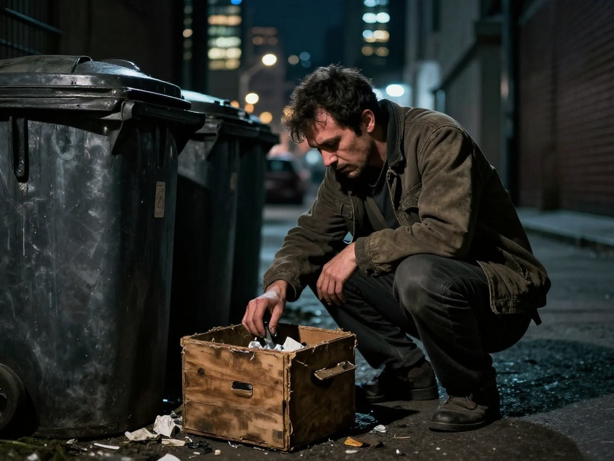

# **Introduction**

There are cities that rise because of a single brilliant mind, and there are cities that rise because a thousand ordinary minds happen to dream in the same direction. This story belongs to the latter kind — a place where prosperity did not arrive with trumpets or heroes, but with the quiet, collective labor of people who believed that dignity could be shared rather than hoarded.

Yet even in such places, shadows remain.

For every era of abundance, there is someone who remembers the age of scarcity with a strange fondness. Someone who cannot bear the thought that greatness might belong to everyone. Someone who believes that life is a battlefield disguised as a marketplace, and that every smile must hide a strategy. This story follows one such man — not because he is a villain, nor because he is a victim, but because he is a mirror held up to a certain kind of mind.

A mind that fears the success of others more than its own failure.  
A mind that clings to old hierarchies even as the world moves on.  
A mind that would rather destroy meaning than share it.

In these pages, prosperity is not merely economic; it is emotional, social, constitutional — the kind of prosperity that frightens those who depend on conflict to define themselves. And in these pages, decline is not merely physical; it is the slow erosion of a worldview that cannot survive in the light.

This is a tale of a man named Losel, who once walked proudly among the people, convinced he understood the secret machinery of human ambition. It is the tale of how he tried to smother the triumphs of others, how he mistook slogans for wisdom, and how he descended into the narcotic quiet of his own making.

It is also, in its own way, a tale of a city that refused to collapse simply because one man insisted it must.

If this book has a lesson, it is not delivered with moral certainty. It is whispered through alleys, spoken in the tone of old tragedies and older ironies — the tone of a world that has seen saints misunderstood, geniuses destroyed, and the powerful undone by their own hands.

What follows is not a warning, nor a prophecy.  
It is simply a portrait.

A portrait of a man who could not imagine a world without winners and losers — and so he became the only loser left in a city that had stopped playing the game.

# **Part I — The Prosperity That Belonged to Everyone**

The city had always been loud — not with chaos, but with the hum of people who believed tomorrow might be better than today. Yet nothing in its long memory compared to the morning when the innovation was unveiled. No one person owned it, no single genius claimed it, no heroic statue was erected to immortalize its inventor. It was a discovery that seemed to rise from the collective mind of the nation, as if the soil itself had whispered the idea upward.

It spread quickly.  
Not like a rumor — like sunlight.

Work became easier.  
Trade became fairer.  
People who had once lived in the shadows of the city’s wealth found themselves stepping into a prosperity that felt earned, shared, and strangely natural. The streets filled with a quiet confidence, the kind that doesn’t need parades or banners. Even the old cynics admitted, with a reluctant shrug, that something good had happened.

But not everyone felt the warmth.

Among the crowds stood a man named **Losel**, watching the celebration with a stiff, almost ceremonial posture. He was not poor, nor was he particularly unsuccessful. In fact, he had once been admired for his ability to “find things” — rare objects, forgotten artifacts, scraps of value in places others overlooked. His reputation had been built on scarcity. On being the one who could deliver what others lacked.

And now, suddenly, people lacked very little.

Losel’s pride was anchored in the *past*, in the era when prosperity was a ladder and every rung mattered. When winners were visible, losers were obvious, and the distance between them was the measure of a man. This new prosperity — this shared, unclaimed, unowned prosperity — offended something deep in him.

He watched the crowds with a tightening jaw.  
He saw joy and interpreted it as arrogance.  
He saw relief and interpreted it as weakness.  
He saw cooperation and interpreted it as a conspiracy to erase the old order he understood.

To Losel, life was a battlefield disguised as a marketplace. Every person was always fighting — for food, for sleep, for women, for money, for power, for the appearance of goodness. Prosperity, in his mind, could never be shared; it could only be won or stolen. So if everyone was rising, someone must be lying. Someone must be hiding the real struggle.

He muttered to himself as he walked through the celebrating streets:

“People don’t change. They just hide their claws better.”

The city’s newfound harmony only sharpened his suspicion. He began to notice things no one else saw — or rather, he *imagined* them. A smile became a secret signal. A handshake became a pact. A successful shopkeeper became a tyrant in disguise. Every improvement was a threat to the world he believed in.

And so, while the nation stepped into a brighter era, Losel stepped sideways — into a shadow of his own making. He clung to the belief that prosperity must have a price, and if no one else was paying it, then the world had simply forgotten to look closely enough.

The innovation had lifted the nation.  
But Losel felt himself sinking.

And in that quiet, private descent, the first seeds of his undoing took root.

# **Part II — Losel’s Descent Into the Narcotic of Control**

The drug did not arrive in the city through the usual channels. It was whispered into existence, like a rumor carried by wind, a substance that seemed less *found* than *invited*. People called it many things, but Losel named it simply **the Quiet** — because that was what it promised him: a world without the noise of other people’s triumphs.

It was not a drug that dulled the senses.  
It dulled the *meaning* of the senses.

A man could win a fortune and feel nothing.  
A woman could lose her home and feel nothing.  
Victory and defeat became identical shadows.

Losel adored it.

He told himself he used it for philosophical reasons. He claimed it freed him from the “primitive illusions” of emotion. But the truth was simpler: he could not bear to see others feel anything he could not control. The Quiet became his tool, his shield, his private weapon against a world that insisted on celebrating without him.

He began with small doses, enough to flatten the edges of his own envy. But soon he discovered that the drug had a second property — one that thrilled him far more. When he shared it with others, even in subtle ways, it softened them. It made them less proud, less joyful, less certain of their own success. It made them easier to dismiss.

Losel became a missionary of numbness.

He wandered the prosperous streets, offering philosophical sermons disguised as compassion:

- “Money is evil,” he would say with a solemn nod.  
- “Power corrupts.”  
- “Ambition is just hunger wearing a suit.”  

People listened politely, but they did not believe him. They were too busy living, too busy feeling. And so Losel began to hide things — small things at first. A merchant’s ledger. A craftsman’s order book. A student’s scholarship letter. Anything that hinted at prosperity, he tucked away, convinced he was protecting society from its own illusions.

He framed it as moral duty.  
He framed it as wisdom.  
He framed it as justice.

But beneath the slogans, his mind was tightening like a fist.

Every conversation he overheard, he interpreted as a coded struggle for dominance. Every handshake was a secret alliance. Every smile was a victory over him. He saw conspiracies in the way people walked, breathed, or looked at the sky. The Quiet amplified his suspicions, smoothing away doubt until only certainty remained — the certainty that everyone was fighting, always fighting, for the same primal prizes he believed defined life.

Food.  
Sleep.  
Women.  
Money.  
Power.  
Appearance.  
Fame.

To Losel, these were not aspects of life; they were the *entire* vocabulary of existence. Anything outside this list was either a lie or a trick. So when people spoke of cooperation, community, or shared prosperity, he heard only hidden motives. When they spoke of gratitude, he heard manipulation. When they spoke of hope, he heard mockery.

The city grew brighter.  
Losel’s world grew dimmer.

He began to use the drug more frequently, not to erase his own emotions now, but to maintain the illusion that everyone else was secretly as hollow as he felt. He needed the Quiet to keep his worldview intact. Without it, the laughter of the city scraped against him like a blade.

And so, while the nation continued to rise, Losel drifted downward — not dramatically, not visibly, but with the slow, inevitable pull of a man who has mistaken gravity for truth.

The Quiet had promised him control.  
Instead, it began to control him.

And the first cracks in his reputation — once so carefully polished — began to show.

# **Part III — The Collapse of Reputation**

Losel had once been known as a man who could find anything.  
A rare coin.  
A misplaced deed.  
A forgotten trinket that someone’s grandmother swore existed.  

People used to come to him with hope in their eyes, believing he possessed a strange talent for uncovering what the world had overlooked. In the old days — the days of scarcity, competition, and visible winners — this made him valuable. It made him *necessary*.

But prosperity has a cruel habit of making certain talents obsolete.

As the city flourished, people needed fewer miracles. They needed fewer treasure‑hunters. They needed fewer men who thrived on the gaps in society. The innovation that had lifted the nation had also quietly erased the shadows where Losel once operated.

He felt it first as a whisper:  
a merchant who no longer needed his services,  
a scholar who found her own documents,  
a craftsman who now kept perfect records thanks to the new system.

Then the whisper became a murmur.  
Then a silence.

Losel’s reputation — once a polished coin — began to tarnish.

He tried to fight it.  
He tried to stay relevant.

He began offering “warnings” instead of treasures. He told people that prosperity was a façade, that the city was rotting beneath its bright surface. He insisted that the innovation was a trick, a trap, a conspiracy designed to lull citizens into complacency.

He repeated his slogans with the zeal of a street preacher:

- “Prosperity is a lie.”  
- “Money is evil.”  
- “Power corrupts.”  
- “If someone rises, someone else must fall.”  

But the city had grown wiser.  
People listened, nodded politely, and walked away.

Losel could not understand it.  
He had always believed that humans were simple creatures driven by simple hungers — food, sleep, women, money, power, appearance. He believed that every smile hid a strategy, every handshake hid a bargain, every success hid a theft. He could not imagine a world where people were not constantly fighting for the same narrow prizes he worshipped.

So when people ignored him, he interpreted it as a new kind of attack.  
A silent war.  
A conspiracy of indifference.

He doubled down.

He sabotaged small things — a misplaced invoice here, a missing permit there — convinced he was exposing the “truth” of society’s fragility. He whispered rumors about honest workers, claiming they were hoarding wealth. He accused innovators of corruption, insisting that no one could succeed without stepping on someone else.

But the city did not crumble.  
It did not even wobble.

Instead, people began to avoid him.  
His name, once spoken with admiration, became a cautionary tale.  
Parents told their children not to linger near him.  
Shopkeepers closed their doors when he approached.

His reputation collapsed not with a dramatic fall, but with a quiet, steady erosion — the kind that leaves a man standing alone in a crowd, shouting truths no one believes.

And as the world stopped listening, Losel turned more desperately to the Quiet.  
He needed it now — not to control others, but to silence the growing fear inside him. The fear that he was no longer part of the story of the city. The fear that the world had moved on without him.

The drug softened the edges of his panic, but it also softened the edges of his identity.  
He became less sharp, less certain, less present.

The treasure‑finder was fading.  
The philosopher of envy was unraveling.

And the city — bright, stable, prosperous — continued forward, leaving Losel behind like a relic of an age defined by scarcity and suspicion.

He had once believed he could not be replaced.  
Now he could not even be remembered.

# **Part IV — The Junkie at the Garbage Cans**

By the time winter crept into the city, Losel had become a familiar silhouette in the alleys — a figure hunched over bins, muttering to himself, searching for treasures that no longer existed. The prosperous streets glowed with warm lights, but the alleys behind them were cold, metallic, and indifferent. It was here that Losel now lived out the final chapter of his unraveling.

He still called himself a “finder,” though no one asked him to find anything anymore. His reputation — once a badge polished by scarcity — had collapsed into a kind of tragic folklore. Children whispered about him as they passed, not with fear, but with the vague pity reserved for someone who had stepped out of time and could not find the way back.

Losel rummaged through garbage cans with a strange reverence, as if each discarded object might vindicate him. He sought things “people did not create,” things untouched by the prosperity he despised. A broken gear. A rusted hinge. A shard of glass. These were his relics — proof, in his mind, that the world still contained hidden value only he could see.

But the truth was simpler: he was searching for the past.

The Quiet — the narcotic that once gave him the illusion of control — had become his only companion. He no longer used it to flatten the emotions of others. He used it to flatten himself. Each dose softened the humiliation, the loneliness, the growing awareness that the city had not conspired against him at all. It had simply outgrown him.

He sat behind a row of restaurants one night, the air thick with the smell of discarded food and cold metal. His hands trembled as he sifted through a bin, pulling out a cracked wooden box. For a moment, his eyes lit up — the old reflex, the old hope. But when he opened it, it was empty.

He stared at the hollow box for a long time, as if expecting it to speak.  
When it didn’t, he whispered to himself:

“Money is evil… power corrupts… ambition is a lie…”

The slogans that once made him feel righteous now sounded like the chants of a man trying to hypnotize himself. They no longer convinced anyone — not even him. They were the last fragments of a worldview that had shrunk to the size of the alley he lived in.

He took another dose of the Quiet.  
His hands steadied.  
His thoughts blurred.

The city behind him thrived — not out of cruelty, but because it had built something stronger than the old games of dominance he believed in. People cooperated. They shared. They prospered without needing a villain to defeat or a hero to worship. The innovation that had lifted the nation continued to do so, quietly, steadily, without asking for applause.

Losel, meanwhile, became a ghost of the old world — a man who could not imagine life without winners and losers, and so he became the only loser left in a city that had stopped playing the game.

He slumped beside the garbage cans, the empty wooden box resting on his lap. The Quiet pulsed through him, numbing everything except the faint ache of being forgotten. His once‑sharp eyes dulled, reflecting nothing but the dim alley lights.

In the end, Losel was not defeated by the city, nor by the innovation, nor by the people he accused.  
He was defeated by the narrowness of his own imagination.

The treasure‑finder had become a junkie.  
The philosopher of envy had become a whisper.  
And the city — bright, stable, prosperous — moved forward, carrying with it the lesson he never learned:

Prosperity shared is not prosperity stolen.  
And a world built together leaves no room for the man who insists everyone must be fighting.

# **Aftermath**

When a story ends, the city remains.  
Streets continue to fill, markets continue to open, and the quiet machinery of daily life resumes its rhythm. Yet every city carries the faint outline of the people who once shaped its shadows — even those who tried, in vain, to halt its progress.

Losel left no monument behind.  
No plaque bears his name.  
No alley is officially dedicated to him.

And yet, in the subtle way that societies remember their own fragilities, he lingers.

People speak of him rarely, and when they do, it is not with cruelty. Instead, they mention him the way one mentions a storm that passed years ago — destructive, yes, but also revealing. His descent exposed something the city needed to understand: that prosperity is not merely a matter of systems and innovations, but of the minds willing to accept them.

For every era of shared abundance, there will be those who cling to the old hierarchies, who believe that life must be a contest, that dignity must be rationed, that success must be a zero‑sum game. Losel embodied that belief so completely that he became its final casualty.

The city learned from him — not through his teachings, but through his collapse.

It learned that envy can survive even in abundance.  
It learned that suspicion can thrive even in transparency.  
It learned that a single mind, trapped in the past, can create its own ruin even as the world around it flourishes.

And so, in the years that followed, the city did not erase Losel’s memory. It folded it quietly into its civic conscience. Teachers spoke of him when discussing the psychology of scarcity. Philosophers referenced him when debating the nature of ambition. Lawmakers remembered him when crafting policies meant to ensure that prosperity remained accessible, visible, and shared.

Not as a warning of what society might become,  
but as a reminder of what one person can refuse to see.

The innovation that lifted the nation continued to do so, proving resilient against cynicism and sabotage. The people continued to rise, not because they were flawless, but because they had learned to rise together.

And somewhere in the collective memory of the city, Losel remained — not as a villain, not as a martyr, but as a footnote in the long story of human progress. A symbol of the truth that prosperity cannot save a man who insists the world must be broken.

In the end, the city did not triumph over him.  
It simply outgrew him.

And that, perhaps, is the quietest and most enduring aftermath of all.

# **Coda — A Note on Fragile Minds**

Every story that deals with decline risks being mistaken for a tragedy.  
But this one is not quite that.  
It is something quieter — a study of a fracture.

For all the systems a society builds, for all the laws and innovations that lift millions, the most delicate structure in any civilization is still the individual mind. Cities can rise from ruins. Nations can rebuild after storms. But a single worldview, once cracked, can collapse with barely a sound.

Losel’s fall was not the fall of a villain.  
Nor was it the fall of a hero.  
It was the fall of a man who could not imagine a world larger than his fears.

And that is why his story matters.

Because somewhere, in every prosperous age, there are those who feel threatened by the success of others, who cling to the belief that life must be a contest, that dignity must be rationed, that the world is only real when someone is losing. They are not monsters. They are not anomalies. They are simply people who never learned to see abundance without imagining theft.

Losel’s life reminds us that progress is not only a matter of invention or policy.  
It is a matter of imagination — the ability to believe that prosperity can be shared without being diluted, that cooperation is not a disguise for domination, that the rise of others is not the fall of oneself.

His story ends in an alley, but its meaning does not.

It lingers as a quiet question for any society that dares to grow:  
How do we build a world where even those who fear abundance can find a place within it?

The city in this tale found its answer.  
Others may still be searching.

And so this coda stands not as a warning, nor as a moral, but as a final reflection:  
that the greatest challenge of prosperity is not achieving it —  
but ensuring that every mind is willing to step into its light.

